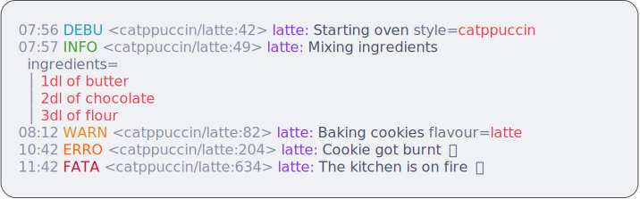
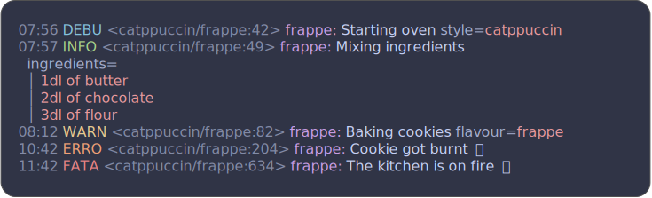
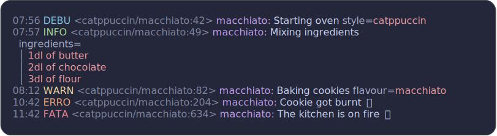
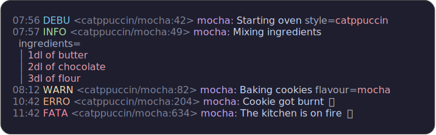

# Red Log

<p>
    <a href="https://github.com/op/redlog/releases"></a>
    <a href="https://pkg.go.dev/github.com/op/redlog?tab=doc"></a>
    <a href="https://github.com/op/redlog/actions"></a>
    <a href="https://goreportcard.com/report/github.com/op/redlog"></a>
</p>

Gloss styles for [logs][log]. 🪵

It contains a set of styles that can be used with the [log] package. The
following themes are provided:

* [catppucchin](https://catppuccin.com) -- adaptive variants

[log]: /charmbracelet/log

🚧 This is a work in progress. Sorry for the inconvenience and odd v1. 🚧

## Gallery

*Catppuccin Latte*

<picture>
    
</picture>

*Catppuccin Frappé*

<picture>
    
</picture>

*Catppuccin Macchiato*

<picture>
    
</picture>

*Catppuccin Mocha*

<picture>
    
</picture>

## Usage

Use `go get` to download the dependency.

```bash
go get github.com/op/redlog@latest
```

Then, `import` it in Go files:

```go
import (
  "github.com/charmbracelet/log"
  "github.com/op/redlog"
)
```

The Red Log package comes with a select few styles of the themes listed above.
These are ready to be used straight away.

```go
log.SetStyles(redlog.Catppuccin.Mocha)
slog.SetDefault(slog.New(log.Default()))
```

## Specific theme

If you want to limit the number of dependencies, or make some customisation of
the theme yourself, you can directly import and use the theme.

```go
import (
  "github.com/charmbracelet/log"
  "github.com/op/redlog/pkg/catppuccin"
)
```

Then initiate the theme the way that suits your needs.

```go
// use an adaptive theme that switches between light and dark depending on the
// terminal's color scheme
variant := catppuccin.Adaptive(catppuccin.Latte, catppuccin.Mocha)
log.SetStyles(catppuccin.Styles(variant))
```
