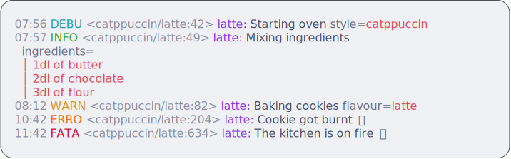

# [Catppuccin](https://catppuccin.com) for [log](https://github.com/charmbracelet/log)

<p align="center">
    <a href="https://github.com/op/redlog/stargazers"></a>
    <a href="https://github.com/op/redlog/issues"></a>
    <a href="https://github.com/op/redlog/contributors"></a>
</p>

<picture>
    
</picture>
<picture>
    
</picture>
<picture>
    
</picture>
<picture>
    
</picture>


Package catppuccin consists of 4 beautiful pastel color palettes, named
flavors. The theme comes in one light and three dark variants.

* 🌻 *Latte* is the lightest theme harmoniously inverting the essence of
  Catppuccin's dark themes.
  
* 🪴 *Frappé* is a less vibrant alternative using subdued colors for a muted
  aesthetic.

* 🌺 *Macchiato* has medium contrast with gentle colors creating a soothing
  atmosphere.

* 🌿 *Mocha* is the original and the darkest variant, offering a cozy feeling
  with color-rich accents.

## Usage

Use `go get` to download the dependency.

```bash
go get github.com/op/redlog/pkg/catppuccin@latest
```

Then, `import` it in Go files:

```go
import (
  "github.com/charmbracelet/log"
  "github.com/op/redlog/pkg/catppuccin"
)
```

To make use of one light and one dark theme, you can create an adaptive style
which automatically switch to the most suitable style based on the terminal's
mode.

```go
theme := catppuccin.Adaptive(catppuccin.Latte, catppuccin.Mocha)
log.SetStyles(catppuccin.Styles(theme))
```

To use a specific variant, use it as-is.

```go
log.SetStyles(catppuccin.Styles(catppuccin.Mocha))
slog.SetDefault(slog.New(log.Default()))
```
